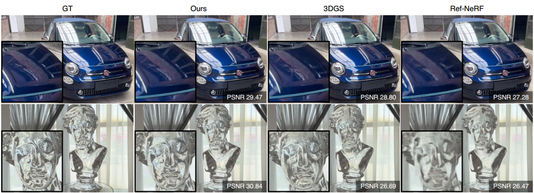

# Local Gaussian Density Mixtures (LGDM) for Unstructured Lumigraph Rendering

Xiuchao Wu, Jiamin Xu, Chi Wang, Yifan Peng, Qixing Huang, James Tompkin, Weiwei Xu



### [Project Page](https://xchaowu.github.io/papers/lgdm/index.html) | [Video](https://www.youtube.com/watch?v=sb1AeLB6tg4) | [Dataset](https://drive.google.com/drive/folders/1dr-hqCDWGJ4AuSvQx8UInTkqYj_821dO) 


To improve novel view synthesis of curved-surface reflections and refractions, we revisit local geometry-guided ray interpolation techniques with modern differentiable rendering and optimization. In contrast to depth or mesh geometries, our approach uses a local or per-view density represented as Gaussian mixtures along each ray. To synthesize novel views, we warp and fuse local volumes, then alpha-composite using input photograph ray colors from a small set of neighboring images. For fusion, we use a neural blending weight from a shallow MLP. We optimize the local Gaussian density mixtures using both a reconstruction loss and a consistency loss. The consistency loss, based on per-ray KL-divergence, encourages more accurate geometry reconstruction. In scenes with complex reflections captured in our LGDM dataset, the experimental results show that our method outperforms state-of-the-art novel view synthesis methods by 12.2% - 37.1% in PSNR, due to its ability to maintain sharper view-dependent appearances.


## Environment 
**GCC/G++**: 9.4.0 

**PyTorch**: 1.9.0+cu111

**Python**: 3.8.12

## Setup
```
cd cuda
bash make.sh
cd ..
cd HashGrid
bash make.sh
```

## Preposess
To estimate the camera poses of your self-captured images,
please run:
```
bash camera_est.sh <DATA DIR>
```
We use the code from [LLFF](https://github.com/Fyusion/LLFF) to run colmap for estimating camera poses.

*It would be better if you do undistortion after camera pose estimation.*


## RUN
Set `DATA_DIR` in `config/default.yaml` to your own data directory.

Modify the code in `run.sh`.
```
python train.py <GPU IDX> config/default.yaml <DATA NAME> <LOG NAME>
```
Then, run
```
bash run.sh
```


## BibTeX
```
@inproceedings{wulgdm2024,
author = {Wu, Xiuchao and Xu, Jiamin and Wang, Chi and Peng, Yifan and Huang, Qixing and Tompkin, James and Xu, Weiwei},
title = {Local Gaussian Density Mixtures for Unstructured Lumigraph Rendering},
year = {2024},
booktitle = {SIGGRAPH Asia 2024 Conference Papers},
articleno = {16},
numpages = {11}
}
```