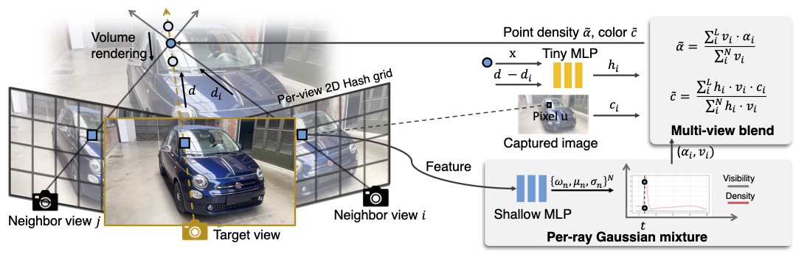

# Local-Gaussian-Density-Mixtures-for-Unstructured-Lumigraph-Rendering

### [Project Page]() | [Video]() | [Dataset]() 

To improve novel view synthesis of curved-surface reflections and refractions, we revisit local geometry-guided ray interpolation techniques with modern differentiable rendering and optimization. In contrast to depth or mesh geometries, our approach uses a local or per-view density represented as Gaussian mixtures along each ray. To synthesize novel views, we warp and fuse local volumes, then alpha-composite using input photograph ray colors from a small set of neighboring images. For fusion, we use a neural blending weight from a shallow MLP. We optimize the local Gaussian density mixtures using both a reconstruction loss and a consistency loss. The consistency loss, based on per-ray KL-divergence, encourages more accurate geometry reconstruction. In scenes with complex reflections captured in our LGDM dataset, the experimental results show that our method outperforms state-of-the-art novel view synthesis methods by 12.2% - 37.1% in PSNR, due to its ability to maintain sharper view-dependent appearances.

